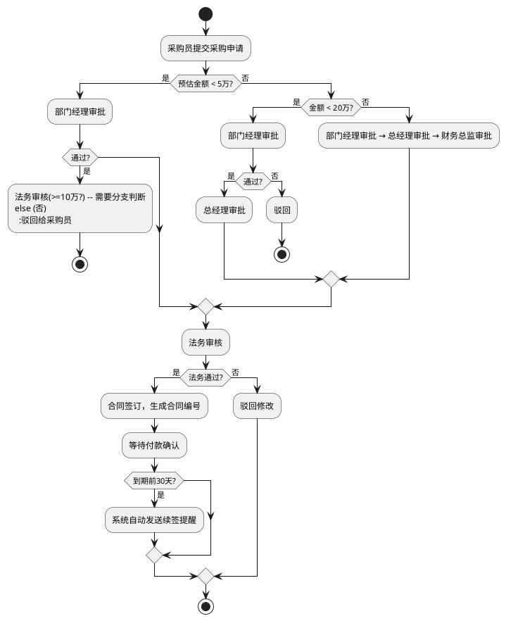

# 流程分析

## 主流程：采购合同审批

```plantuml
@startuml
start
:采购员提交采购申请;
if (预估金额 < 5万?) then (是)
  :部门经理审批;
  if (通过?) then (是)
    :法务审核(>=10万?) -- 需要分支判断
  else (否)
    :驳回给采购员;
    stop
  endif
else (否)
  if (金额 < 20万?) then (是)
    :部门经理审批;
    if (通过?) then (是)
      :总经理审批;
    else (否)
      :驳回;
      stop
    endif
  else (否)
    :部门经理审批 → 总经理审批 → 财务总监审批;
  endif
endif
:法务审核;
if (法务通过?) then (是)
  :合同签订，生成合同编号;
  :等待付款确认;
  if (到期前30天?) then (是)
    :系统自动发送续签提醒;
  endif
else (否)
  :驳回修改;
endif
stop
@enduml
```

## 关键决策点
1. 金额分级：5万和20万两个阈值决定审批路径
2. 法务审核触发：>=10万
3. 分期付款期数：>=3期需财务总监额外审批
4. 合同状态：草稿→待审批→审批中→已签订→执行中→已完成→已过期
