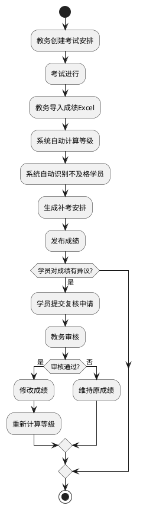

# 流程分析

## 主流程：成绩管理

```plantuml
@startuml
start
:教务创建考试安排;
:考试进行;
:教务导入成绩Excel;
:系统自动计算等级;
:系统自动识别不及格学员;
:生成补考安排;
:发布成绩;
if (学员对成绩有异议?) then (是)
  :学员提交复核申请;
  :教务审核;
  if (审核通过?) then (是)
    :修改成绩;
    :重新计算等级;
  else (否)
    :维持原成绩;
  endif
endif
stop
@enduml
```

## 关键决策点
1. 成绩等级判定：>=90优秀，>=80良好，>=60及格，<60不及格
2. 复核申请审核：通过则修改成绩，不通过则维持
3. 数据可见性：学员→自己，部门经理→本部门，教务→全部
